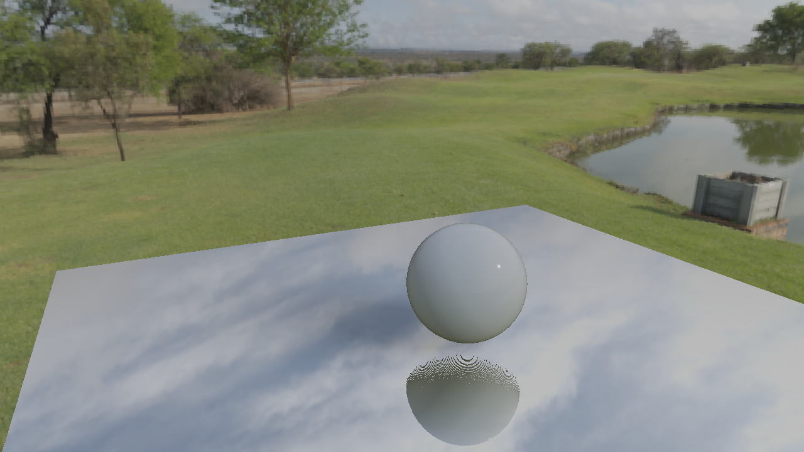

# PBRLookDev #
Welcome to PBRLookDev! 
This is a C++ OpenGL project used to test advanced realtime rendering techniques.

## Features ##
### Standard IBL and Metallic Workflow ###
|Metallic| Plastic|
| ------------- |------------- |
|||

### Subsurface Scattering ###

### Point Light & Shadow ###
|light| hard shadow|soft shadow 1|soft shadow 2| darker shadow|
| ------------- |------------- |------------- |------------- |------------- |
||||||

### Screen Space Reflection ###

